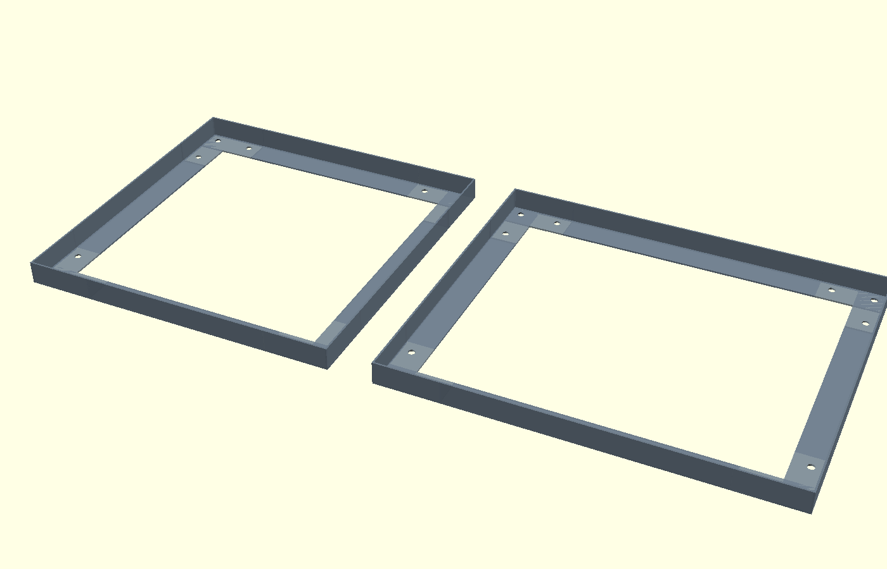

# PIU Bracketless Conversion

Pieces to mod a classic (corner-bracket style) Pump It Up arcade dance pad into bracketless. The main interesting pieces are:
- `frame_mod.scad`: replaces the corner rubber piece. Covers the main frame screw to protect it from dust and has a piccket for a rivet and spacer, for your bracketless panel.
- `center_panel.FCStd` and  `corner_panel.FCStd`: panel models, meant to be exported into CNC cutting instrucitons. Some pre-exported files included, not yet tested. Discussed below.
- `frame.scad`: in case you want to print a full frame instead of keeping the metal ones.
- `assembly.scad`: to visualize the expected result.

Other 3D models like screws, spacers, and the OpenSCAD panels are there for reference and for the assembly, ensuring it all fits together, but not meant to be printed.

THIS IS STILL IN BETA, LET ME PRINT AND TEST MYSELF BEFORE YOU WASTE MATERIAL.

## Screenshots

### Assembly

### Corner piece

## Hardware (per corner)

| Part | Spec | Notes |
|---|---|---|
| Rivet nut | M6, hex body, 13mm flange OD, 15mm total height | Press-fit into corner piece from bottom |
| Spacer / standoff | M6 male-female, 8mm OD body, 10mm body height, 8mm stud | Screws into rivet nut, protrudes above piece |
| Panel screw | M6 countersunk, 12mm length | Sits recessed in panel countersink |
| Frame screws | M5, quantity 3 per corner | Pad-to-frame + 2× leg screws |

**Panels:** 10mm polycarbonate sheet, CNC cut.

---

## Credits

Thanks to Nirvash for the idea for the corner piece.
Thanks to Vaughan14 in the Ryhthm Game Cabs discord server for the original schematics of the panels.
Thanks dj505 in thingiverse for the initial STL files for bracketless frames. I took a lot of measurements from there.
