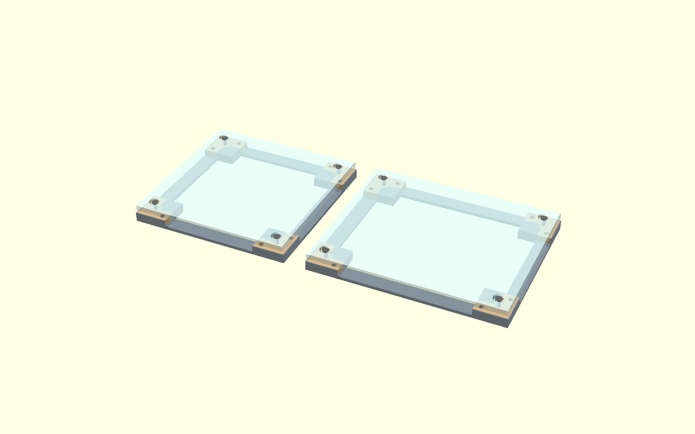
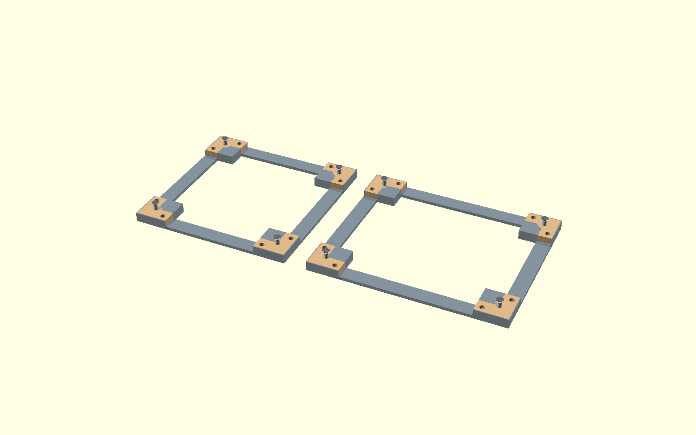
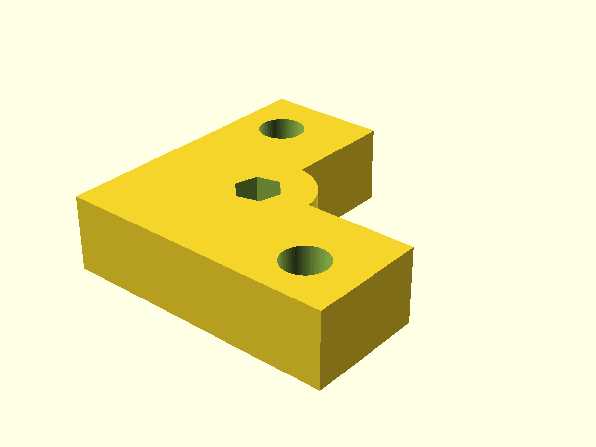
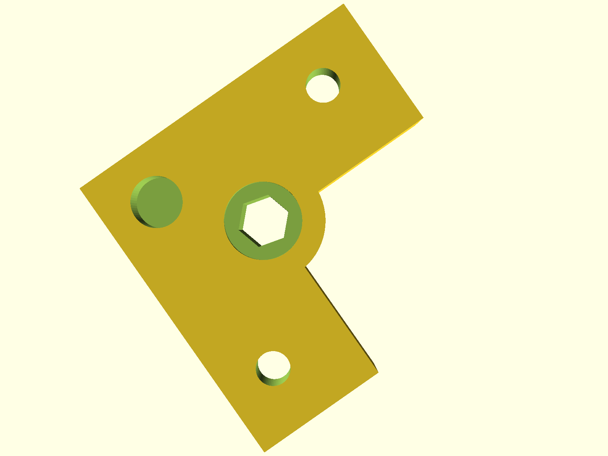

# PIU Bracketless Conversion

Converts an old-style Pump It Up arcade dance pad (corner-bracket style) to bracketless style.

The original design uses metal corner brackets + rubber L-pieces to hold the panels down. This mod replaces both with a single 3D-printed corner piece that uses a rivet nut + spacer system instead.

## Screenshots

### Assembly





### Corner piece





---

## How it works

**Original stack (bottom to top):** frame → metal bracket → rubber L-piece → panel → bolt

**Mod stack (bottom to top):** frame → 3D-printed corner piece (with embedded rivet nut) → spacer → panel → M6 countersunk screw

The corner piece sits in a pocket in the frame corner. A rivet nut is pressed into the piece from the bottom. An M6 male-female standoff (spacer) screws into the rivet nut and protrudes above the piece. The panel drops over the spacer, and an M6 countersunk screw locks it from the top.

---

## Hardware (per corner)

| Part | Spec | Notes |
|---|---|---|
| Rivet nut | M6, hex body, 13mm flange OD, 15mm total height | Press-fit into corner piece from bottom |
| Spacer / standoff | M6 male-female, 8mm OD body, 10mm body height, 8mm stud | Screws into rivet nut, protrudes above piece |
| Panel screw | M6 countersunk, 12mm length | Sits recessed in panel countersink |
| Frame screws | M6, quantity 3 per corner | Pad-to-frame + 2× leg screws |

**Panels:** 10mm polycarbonate sheet, CNC cut.

---

## Files

### 3D-printed parts

| File | Description |
|---|---|
| `frame_mod.scad` | **Main part — print 4×.** L-shaped corner piece with rivet nut pocket, pad-to-frame half-hole, and side leg holes. Tune all dimensions at the top of the file. |

### Reference / visualization models (do not print)

| File | Description |
|---|---|
| `frame.scad` | Parametric frame model. Used in assembly for visualization. |
| `rivet_nut.scad` | Rivet nut reference model. |
| `spacer.scad` | M6 standoff reference model. |
| `screw_m6_csk.scad` | M6 countersunk screw reference model. |

### Assembly visualization

| File | Description |
|---|---|
| `assembly.scad` | Full assembly — shows center pad (278×278) and corner pad (334×278) side by side. Visibility flags at the top of the file let you show/hide individual parts. |

### CNC panel files

| File | Description |
|---|---|
| `panel_cnc.scad` | Shared panel geometry (hole profile, chamfer). |
| `panel_center_cnc.scad` | Center panel: 278×278mm. |
| `panel_corner_cnc.scad` | Corner panel: 334×278mm. |
| `panel_cnc_export.scad` | DXF export helper. Set `LAYER` and `PANEL_W`, export as DXF. |
| `dxf_export/` | Pre-exported DXF files for both panel sizes, one file per machining operation. |

---

## Panel hole layers (for CNC)

The panel hole at each corner is a 3-step profile:

| Layer | DXF file | Diameter | Depth from top |
|---|---|---|---|
| Through drill | `*_drill.dxf` | 11mm | Full (10mm) |
| Mid pocket | `*_mid_pocket.dxf` | 16mm | 5mm |
| Top countersink | `*_top_pocket.dxf` | 20mm | 2mm |
| Outer cut | `*_outline.dxf` | — | Full (10mm) |

Import the relevant DXF files into your CAM software and assign the depths above. For laser cutters or basic routers, `outline` + `drill` are the minimum needed; pocket layers require depth control.

---

## Tunable parameters

All key dimensions are constants at the top of `frame_mod.scad`:

```
arm_length        length of each L arm
arm_width         width of each L arm
height            corner piece height (not full frame thickness)
spacer_from_outer panel screw center from outer face (must match panel hole offset)
rivet_*           rivet nut dimensions
pad_screw_dia     pad-to-frame screw hole diameter
side_hole_spacing spacing between pad hole and leg holes
```

---

## Alignment notes

- `spacer_from_outer = 22.7` matches the panel hole offset (22.7mm from panel edge).
- The frame has 1.5mm outer walls. Hole positions in `frame.scad` are offset by `wall_t = 1.5` to align with the corner piece.
- The corner piece sits in a 15mm deep pocket; the frame total height is 16.5mm (1.5mm base).

---

## Assembly order

1. Press rivet nut into corner piece from the bottom (hex body up).
2. Drop corner piece into frame corner pocket, flat side down.
3. Screw M6 standoff into rivet nut from above until snug.
4. Fasten corner piece to frame using 3 screws per corner (pad-to-frame hole + 2 leg holes).
5. Lower panel over all 4 spacers.
6. Drive M6 countersunk screw into each spacer until head is below panel surface.


---

## Creadits

Thanks to Vaughan14 in the Ryhthm Game Cabs discord server for the original schematics of the panels.
And thanks dj505 for the initial STL files for bracketless frames. I took a lot of measurements from there.
